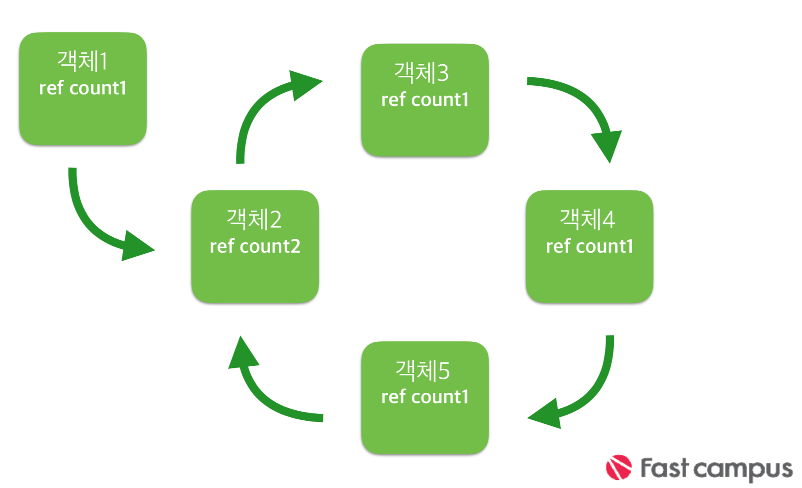

## ARC

### 메모리 관리 방식

>* 명시적 해제 : 모든것을 개발자가 관리함

>* 가비지콜렉터 : 가비지 콜렉터가 수시로 확인해서 안쓰는 객체를 해제 시킴(시스템 부하) 

>* 레퍼런스 카운팅 : 오너쉽 정책에 의해 객체의 해제 정의

---

### Ownership Policy

>* 인스턴스 객체의 오너만이 해당 인스턴스의 해제에 대해서 책임을 진다

>* 오너쉽을 가진 객체만 reference count가 증가 된다.

---

### 애플은 ARC 도입 이유

>* 앱의 비정상 종료 원인 중 많은 부분이 메모리 문제. 메모리 관리는 애플의 앱 승인 거부(Rejection)의 대다수 원인 중 하나.
>* 많은 개발자들이 수동적인 (retain/release) 메모리 관리로 힘들어 함
>* retain/release 로 코드 복잡도가 증가.

---

### ARC

>Automatic Reference Counting의 약자로 기존에 수동 (MRC라고 함)으로 개발자가 직접 retain/release를 통해 reference counting을 관리해야 하는 부분을 자동으로 해준다.

---

### ARC 규칙

>* retain, release, retainCount, autorelease, dealloc을 직접 호출할 수 없다.

>* 구조체내의 객체 포인트를 사용할 수 없다. 

>* id나 void * type을 직접 형변환 시킬 수 없다. 

>* NSAutoreleasePool 객체를 사용할 수 없다.

---

### 순환 참조

---

### weak pointer 사용 이유

>* 순환 참조를 막기위해

>* Autorelease pool을 대신해서 자동 해제가 필요

>* 한 경우 view의 strong 참조 때문에

---

### Unowned vs Weak

>* Unowned : 소유권이 없는 참조임을 나타내는 지시어 

>* Optional 차이   
>	1. Unowned : 절대 nil이 아니다.   
>	2. Weak : nil 일수도 있다

---

