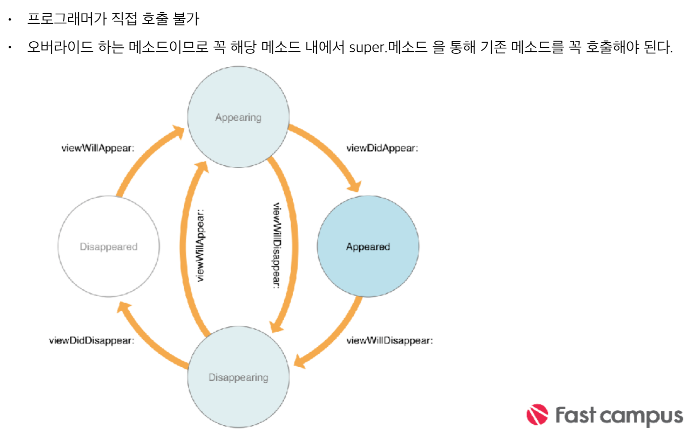

## Application Life Cycle

### Event에 대한 처리
>* Touch : 발생된 이벤트에 대한 뷰가 처리

>* Remote control & Shake motion events : First responder객체 

>* Accelerometer/Magnetometer/Gyroscope : 각각의 객체로 전달 

>* Location :CoreLocation 객체

>* Redraw : 업데이트를 원하는 뷰가 처리

---

### Execution States for Apps

>* Not Running : 실행되지 않았거나, 시스템에 의해 종료된 상태

>* Inactive : 실행 중이지만 이벤트를 받고있지 않은 상태. 예를들어, 앱 실행 중 미 리알림 또는 일정 얼럿이 화면에 덮여서 앱이 실질적으로 이벤트를 받지 못하는 상태 등을 뜻한다.

>* Active : 어플리케이션이 실질적으로 활동하고 있는 상태

>* Background : 백그라운드 상태에서 실질적인 동작을 하고 있는 상태. 예를들어 백그라운드에서 음악을 실행 하거나, 걸어온 길을 트래킹 하는 등의 동작을 뜻한다.

>* Suspended : 백그라운드 상태에서 활동을 멈춘 상태. 빠른 재실행을 위하여 메 모리에 적재된 상태이지만 실질적으로 동작하고 있지는 않다. 
메모리가 부족할 때 비로소 시스템이 강제종료하게 된다.

---

### Call to the methods of your app delegate object

> 대부분의 상태변화를 app delegate 객체에 호출되는 메소드를 오버라이드하여 알아챌 수 있다.

>* application:willFinishLaunchingWithOptions: 어플리케이션이 최초 실행될 때 호출되는 메소드

>* application:didFinishLaunchingWithOptions:
 어플리케이션이 실행된 직후 사용자의 화면에 보여지기 직전에 호출.
 
>* applicationDidBecomeActive: 어플리케이션이 Active 상태로 전환된 직후 호출.

>* applicationWillResignActive:
 어플리케이션이 Inactive 상태로 전환되기 직전 호출

>* applicationDidEnterBackground:
 어플리케이션이 백그라운드 상태로 전환된 직후 호출.

>* applicationWillEnterForeground:
 어플리케이션이 Active 상태가 되기 직전에, 화면에 보여지기 직전의 시점에 호출.

>* applicationWillTerminate:
어플리케이션이 종료되기 직전에 호출.

---

### Supported Background Tasks

>* Audio and AirPlay (음악)

>* Location updates (위치 정보)

>* Voice over IP (인터넷을 사용한 음성통화)

>* Newsstand downloads(뉴스 스탠드 다운로드)

>* External accessory communication (기타 하드웨어 액세사리)

>* Bluetooth LE accessories (블루투스 액세사리 사용)

>* Background fetch (네트워크를 통한 일반적인 다운로드나 미완료된 작업)

>* Remote notifications (PushNotification)

---

### 생명주기

>* override func loadView() : UIViewController의 view가 생성될 때 호출

>* override func viewDidLoad() :  
UIViewController가 인스턴스화 된 직후(메모리에 객체가 올라간 직후) 호출 처음 한 번 세팅해 줘야 하는 값들을 넣기에 적절

>* override func viewWillAppear(_ animated: Bool) : 
view가 화면에 보여지기 직전에 호출 화면이 보여지기 전에 준비할 때 사용.  

>* animated 파라미터는 뷰가 애니메이션을 동반하여 보여지게 되는지 시스템에서 전달해주는 불리언 값

>* override func viewWillLayoutSubviews() : view의 하위뷰들의 레이아웃이 결정되기 직전 호출

>* override func viewDidLayoutSubviews() :  
view의 하위뷰들의 레이아웃이 결정된 후 호출. 주로 view의 하위뷰들이 사이즈 조정이 필요할 때 호출

>* override func viewDidAppear(_ animated: Bool) :  
view가 화면에 보여진 직후에 호출. 화면이 표시된 이후 애니메이션 등을 보여주고 싶을 때 유용

>* override func viewWillAppear(_ animated: Bool) : view가 화면에서 사라지기 직전에 호출 

>* override func viewDidDisappear(_ animated: Bool) : view가 화면에서 사라진 직후에 호출
