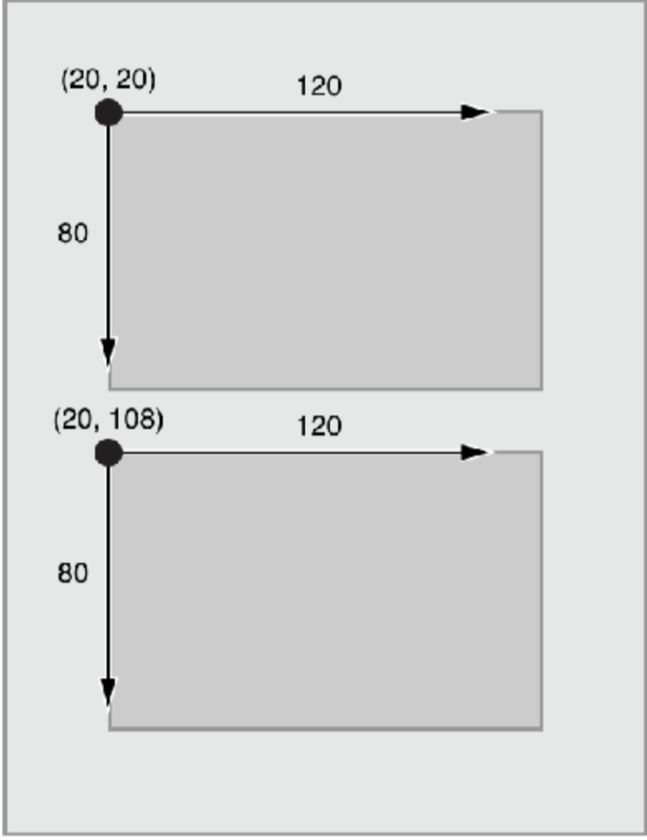
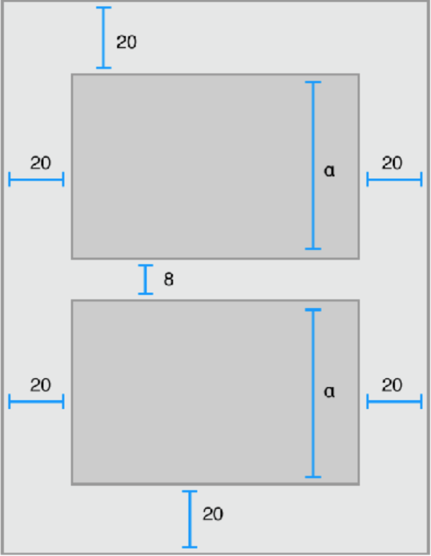
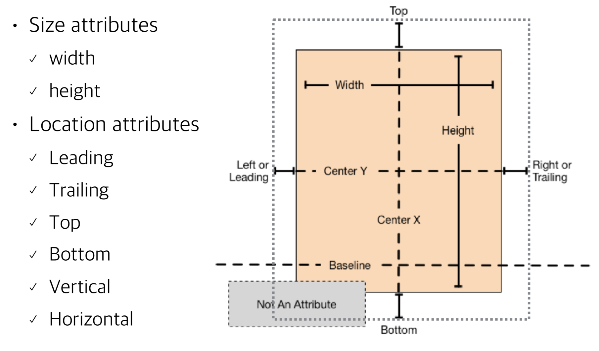
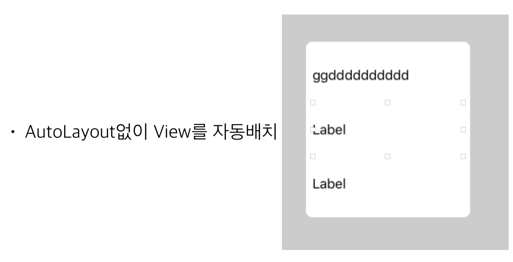
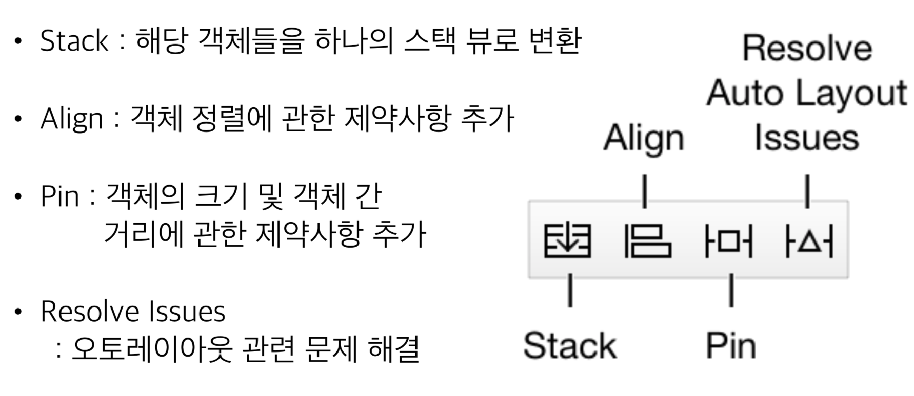
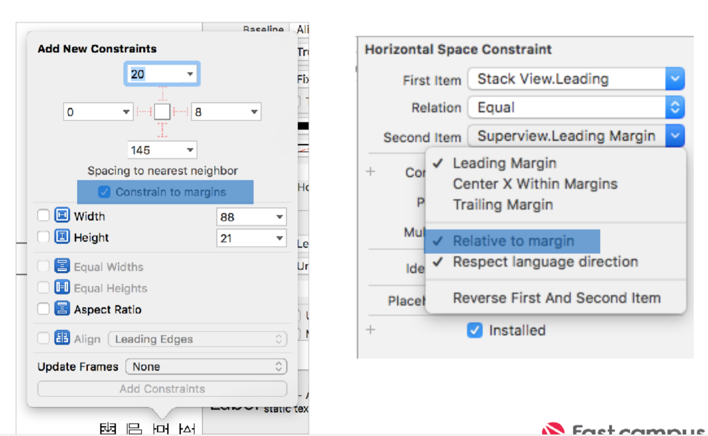

## AutoLayout

### Storyboard 사용하기

>* IBOutlet : UI 아울렛 연결 IBAction : 

>* UIAction 추가

---

### FrameBaseLayout

---

### Auto

---

### Attribute

---

### StackView

---

### 제약사항 만들기

* AutoLayout Menu

* Layout Margin 삭제

