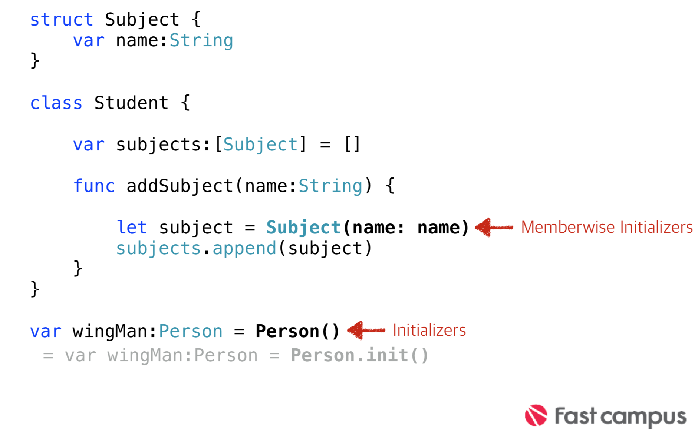

###Classes & Structures
>* 클래스와 구조체는 당신의 프로그램코드에 범용적이고 유연한 구조로 만들어진 블록이다.

>* 상수, 변수 및 함수와 동일한 문법을 사용하여 클래스 및 구조체에 프로퍼티와 메서드를 정의한다.

>* 프로그램 코드 블록의 기본 구조이다.   

>* 프로퍼티와 메서드를 추가 할수 있다. (두 구조의 문법 같음)

>* 단일 파일에 정의 되며(필수는 아니다) 다른 코드에서 자동으로 사용 할수 있다.(접근 제한자에 따라 접근성은 차이가 있다. internal 기본 접근 제한자)   

>* 인스턴스 생성 및 초기 상태를 설정하기 위해 initializer(초기화 메소드)를 사용 하고, 사용자의 니즈에 맞춰 Custom한 initializer를 만들어 사용할 수 있다.   

>* 둘 구조 모두 메모리에 적재되면 instance라고 불린다.   

>* 기본 블록에 추가하여 확장된 블록을 추가 할 수 있다. (Extensions)   

>* 프로토콜을 채택하여 사용할 수 있다.


### Properties 접근

```swift
let someVideoMode: VideoMode = VideoMode()   
print("VideoMode is \(someVideoMode.resolution.width)”)   

let someResolution: Resolution = Resolution()   
print("Resolution is \(someResolution.width)”)
```

---

### Initialization(초기화)

>* 인스턴스에 설정된 속성의 초기값을 설정과 초기화하는데 목적이 있다.

>* 클래스 및 구조체는 인스턴스로 만들어 질때 모든 프로퍼티는 적절한 초기값으로 모두 초기화 해야 한다.

>* 구조체는 자동으로 Memberwise Initializers가 만들어 진다.


>base Initializers

---


>Memberwise Initializers

---


>Custom Initializers

---

## 상속과 Initializers
>* 부모 클래스로부터 상속받은 모든 저장 속성은 초기화할 때 초기 값을 할당받아야 함.

>* Swift는 클래스 타입에 모든 저장 속성에 초기 값을 받도록 도와 주는 두 가지 이니셜라이저를 정의함. 이를 지정 이니셜라이저 (designated initializers)와 편의 이니셜라이저(convenience initializers)라고 함.


>Designated initializers

---


>Convenience initializers

---


>Required Initializers

---


>Setting a Default Property Value with a Closure or Function

---

## Classes VS Structures
>* Class는 참조 타입이며, Structure는 값 타입이다.

>* Class는 상속을 통해 부모클래스의 특성을 상속받을수 있다.

>* Class는 Type Casting을 사용할수 있다.(Structure 불가)

>* Structure의 프로퍼티는 instance가 var를 통해서 만들어야 수정 가능하다.

>* Class는 Reference Counting을 통해 인스턴스의 해제를 계산한다.

>* Calss는 deinitializer를 사용할수 있습니다.

---

### Struct - Value Type 프로퍼티 수정

```swift
struct Point {
    var x = 0.0, y = 0.0
    mutating func moveBy(x deltaX: Double, y deltaY: Double) {
		x += deltaX
		y += deltaY 
	}
}
```
>* 기본적으로 구조체와 열거형의 값타입 프로퍼티는 인스턴스 메소드 내에 서 수정이 불가능 하다.

>* 그러나 특정 메소드에서 수정을 해야 할 경우에는 mutating 키워드를 통해 변경 가능하다.

---

### Class - Deinit

```swift
 class Student {
      init() {
		//인스턴스 생성시 필요한 내용 구현 
		}
		deinit {
		//종료직전 필요한 내용 구현
		} 
}
```

---

### Class - 상속

>* Subclassing

>* 기존에 구현되어있는 클래스를 확장, 변형

>* 부모 클래스(super class, parent class)와  
자식 클래스(sub class, child class)로 관계를 표현
>* 상속 할 수록 더 확장되는 구조 즉, 자식이 기능이 더 많다.

---

### 클래스의 상속

>* Swift에선 단 하나의 클래스만 상속 받을수 있다. 

>* Struct, enum은 상속 받을수 없다.

>* 클래스 이름뒤에 (: 부모클래스) 를 추가 한다. 

>* 프로토콜과 문법이 같다.

---

## 재정의(override)

> 부모 클래스에게서 물려받은 성질을 그대로 사용하지 않고 자식 클래스에게 맞는 형태 또는 행위로 변경하여 사용할 수 있는 기능

---

### 다형성

>* 재정의(Override)와 중복정의(Overload)는 OOP의 다형성의 또다른 모습

>* Objective-C는 중복정의(Overload)를 지원하지 않습니다

>* Swift에서는 중복정의(Overload)를 지원합니다.

---

### 애플 가이드라인

>* 연관된 간단한 값의 집합을 캡슐화하는 것만이 목적일 때

>* 캡슐화된 값이 참조되는 것보다 복사되는 것이 합당할 때

>* 구조체에 저장된 프로퍼티가 값타입이며 참조되는 것보다는 복 사되는 것이 합당할때

>* 다른 타입으로부터 상속받거나 자신이 상속될 필요가 없을 때 