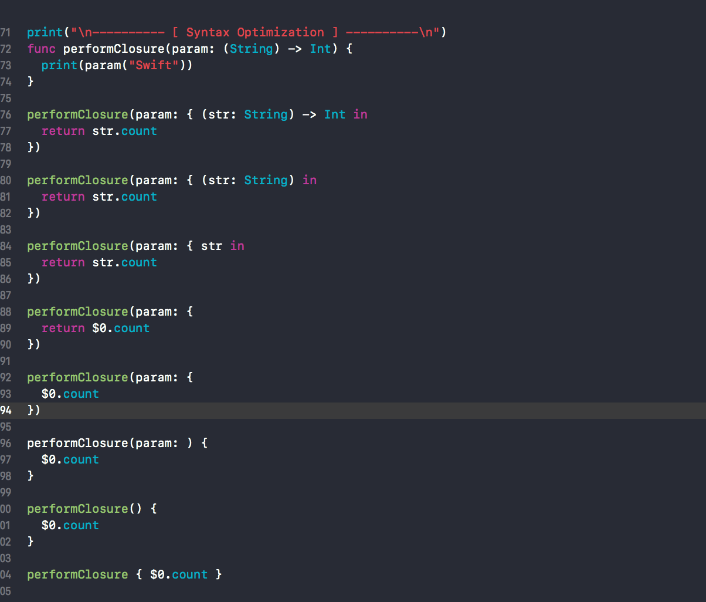
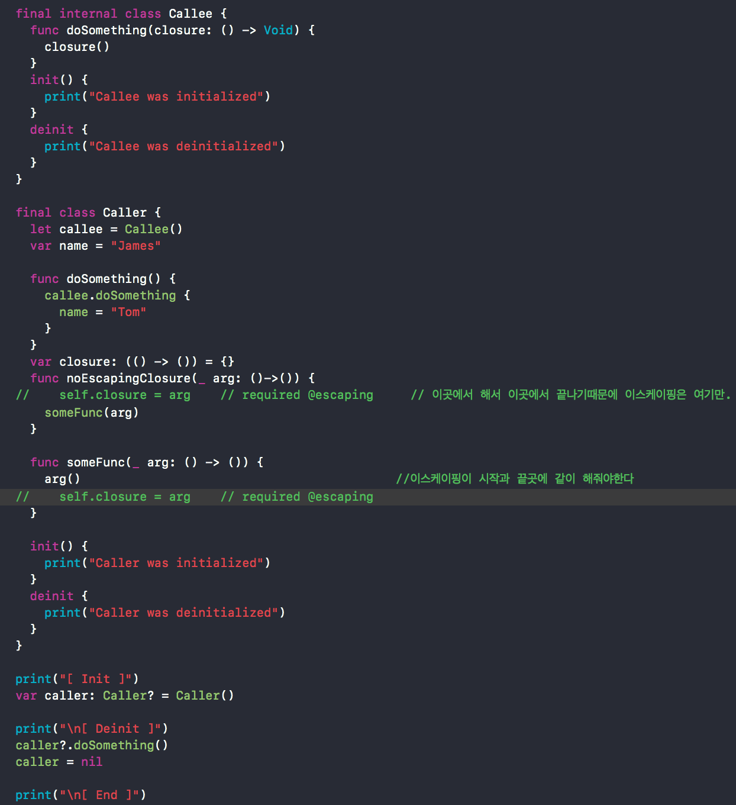
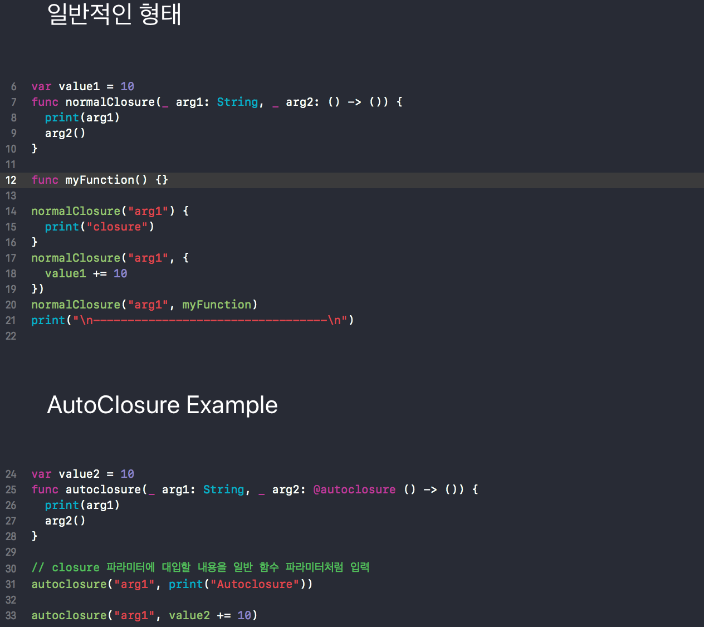

## Closure

### Syntax Optimization


---

### Capture

#### Value Type Capture

```swift
print("\n---------- [ Value Type Capture ] ----------\n")
var a = 1
var b = 2
var c = 10
var result = 0
print("초기화 값 :", a, b, c, result)
print("a, b 만 캡쳐")
let valueCapture = { [a, b] in      //캡쳐한것이 초기값을 유지한다
  result = a + b + c
  print("클로저 내부 값 :", a, b, c, result)
}

a = 10
b = 10
c = 5
result = a + b + c
print("변경 값 :", a, b, c, result)

valueCapture()
print("실행 이후 값 :", a, b, c, result)
```

---


#### Reference Type Capture

```swift

print("\n---------- [ RefType Capture ] ----------\n")

final fileprivate class RefType {
  var number = 0
}
fileprivate var x = RefType()  // 위에 클래스에서 fileprivate했기에 해줘야함
fileprivate var y = RefType()
print("초기화 값 :", x.number, y.number)

let refCapture = { [x] in
  print("클로저 내부 값 :", x.number, y.number) // 힙쪽에 들어간 값이 바뀌어버리기때문에 계속 x 만 캡쳐해봐야 고정이 안된다
}
x.number = 5
y.number = 7
print("변경 값 :", x.number, y.number)

refCapture()
print("실행 이후 값 :", x.number, y.number)

```

---


#### Binding an arbitrary expression

```swift
print("\n---------- [ binding ] ----------\n")
let captureBinding = { [z = x] in
  print(z.number)
}
let captureWeakBinding = { [weak z = x] in
  print(z?.number ?? 0) //nil 일경우에 0이 반환되라고 하는게 ?? 이거다
}
let captureUnownedBinding = { [unowned z = y] in
  print(z.number)
}

captureBinding()
captureWeakBinding()
captureUnownedBinding()

```

---

#### NoEscaping



---

#### Escaping
    
```swift    
callee.doSomething { [weak self] in
      DispatchQueue.main.async {                 // 이것처럼 위에다가 weekself 해야 한다
        self?.name = "Tom"   // Release
      }
}
callee.doSomething {
      DispatchQueue.main.async { [weak self] in
        self?.name = "Tom"   // Leak                  //아래쪽에서 week self하면 위험할 수 있다
     }
}

```

---

#### AutoClosure


