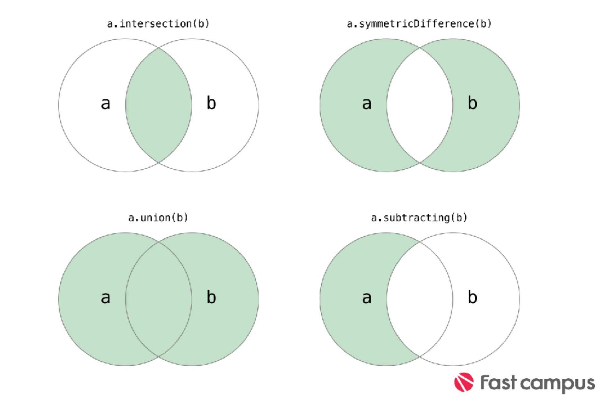

## Collection Type

#### Array
>번호(인덱스)와 대응하는 데이터들로 이루어진 자료 구조
일반적으로 배열에는 같은 종류의 데이터들이 순차적으로 저장되어, index가 값이 저장되어 있는 상대적인 위치가 된다.

```swift
var someInts:[Int] = [1,2,3,4]
        print("\(someInts[0])")
        print("\(someInts[3])")
```

> * 기본 표현은 Array<Element>로 Array Type을 나타낸다.
 
>* 여기에서 Element는 배열에 저장할수 있는 타입이다.

>* 또 다른 축약 문법으로 [Element] 로 표현할 수 있다.

* 현재 배열의 element 수 -> count  

* 빈 배열 확인 -> isEmpty    

* element 추가 -> append   

* element 삽입 -> insert   

* element 삭제 -> remove   

---

####Set
>* 기본 표현은 Set<Element>로 Set Type을 나타낸다.

>* 여기에서 Element는 배열에 저장할수 있는 타입이다.
 
>* Set은 Array와 다르게 축약 문법이 없다.

1. Set 리터럴

```swift
[값1, 값2, 값3]

var someInts:Set<Int> = [1,2,3,4]

someInts = []

var someStrings:Set = [“joo”,”young”]
```
>* Set은 순서가 정해져 있지 않기 때문에 for-in 구문을 통해서 데이터를 가져와야 한다.   

>* 순서는 정해져 있지 않지만 정렬을 통해 데이터를 원하는 순서대로 가져올 수 있다.   

---

2. Set 집합	 연산



```swift
var oddDigits : Set = [ 1, 3, 5, 7, 9 ]
let evenDigits : Set = [2, 4, 6, 8]
let primeDigits : Set = [2, 3, 5, 7]
 
oddDigits.intersection(evenDigits)
oddDigits.symmetricDifference(primeDigits)
oddDigits.union(evenDigits).sort()
oddDigits.subtract(primeDigits).sort()
```

---

####Dictionary
>* Dictionary는 순서가 정해져 있지 않은 데이터에 키값을 통해 구분할 수 있는 자료구조. 

>* 항목의 순서가 중요치 않고 key값을 통해서 데이터를 접근할때 사용한다.

>* 기본 표현은 Dictionary<key, value>로 나타낸다

>* Dictionary Type에 Key값은 Dictionary에서 value를 가져오는데 사용되는 값이다.

>* 또 다른 축약 문법으로 [key:value] 로 표현할 수 있다.

```swift
var someInts:[String:Int] = [String:Int]()
var someInts:Dictionary<String,Int> = [:]
  
var airports: [String:String] = ["ICH": "인천공항", "CJU": "제주공항"] 
print("\(airports["ICH"])")
print("\(airports["CJU"])")

```

