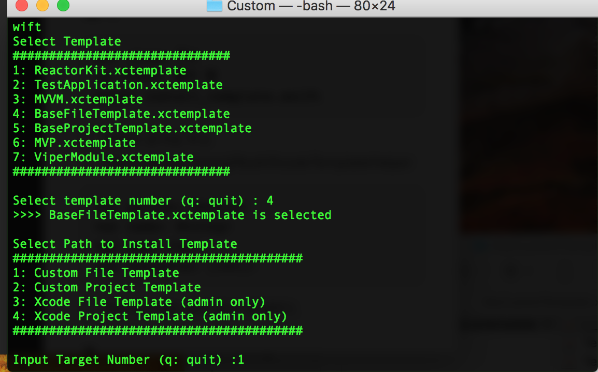
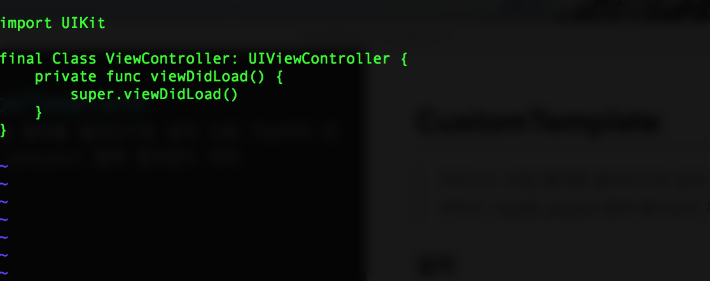
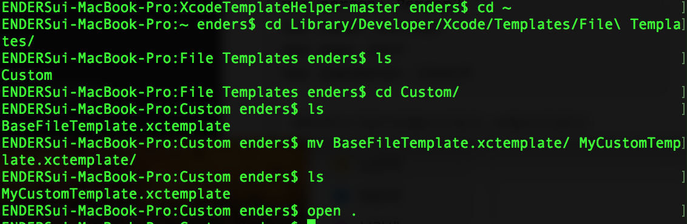
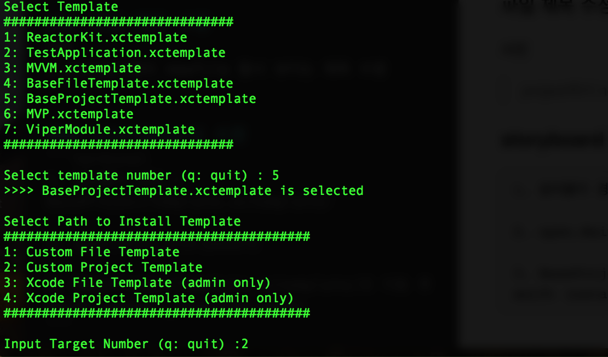
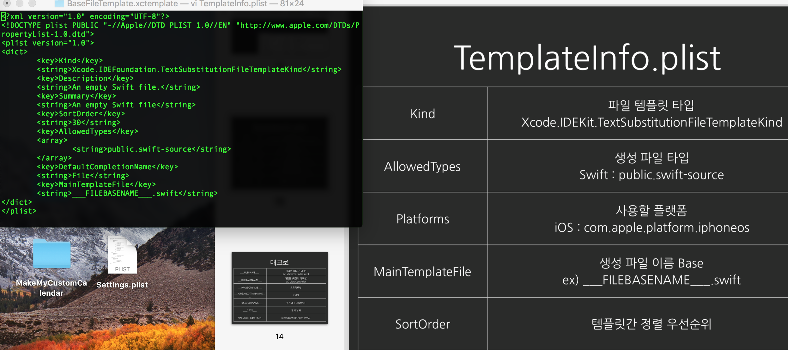

## CustomTemplate
> 자주쓰는 파일 형태를 불러오기로 쉽게 사용 가능하게 만든다. test용 project 할때 평의성이 목적

### 설치




```terminal
git clone 주소
cd 다운받은 폴더 명 
swift install_template.swift
```
> 이봉원 강사님 주소 https://github.com/giftbott/XcodeTemplateHelper

---

### 내용 수정



```terminal
설치 폴더 경로/BaseFileTemplate.xctemplate/이동
 vi ___FILEBASENAME___.swift 실행 후 수정

:w -> 저장
:q -> 나가기

Finder에서 ___FILEBASENAME___.swift 실행 후 내용수정 가능
```

---

### 파일 제목 수정



> project에서 newfile 할시 보이는 제목 수정 

---

### storyboard 수정

```terminal
1. 설치폴더 경로 / BaseProjectTemplate.xctemplate/

2. open.Main_storyboard

3. BaseProjectTemplate.xctemplate/로 이동 후
swift install_template.swift 

4. 새로운 project 실행시 custom에 있다
```



---

### fileinfo 수정

