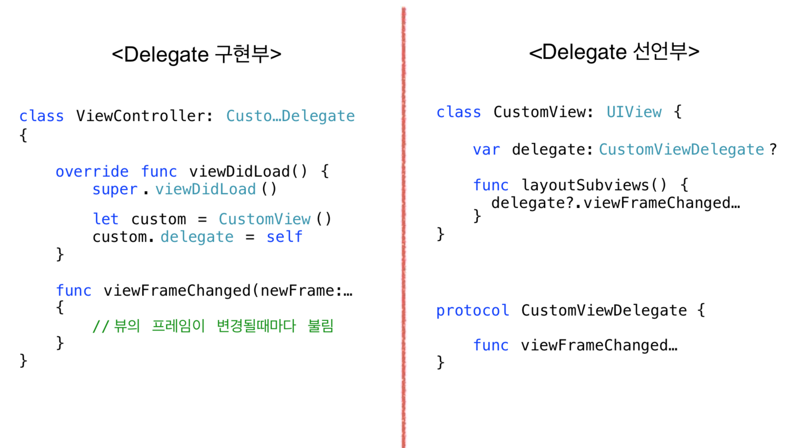
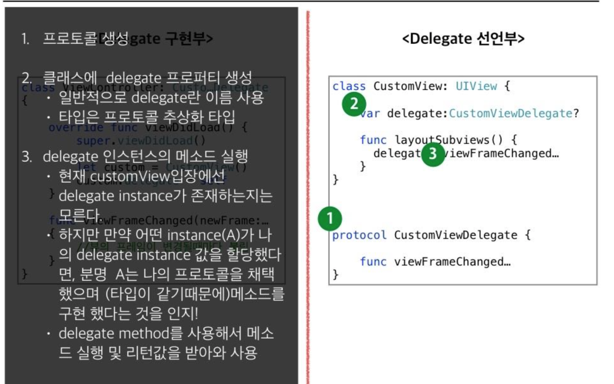
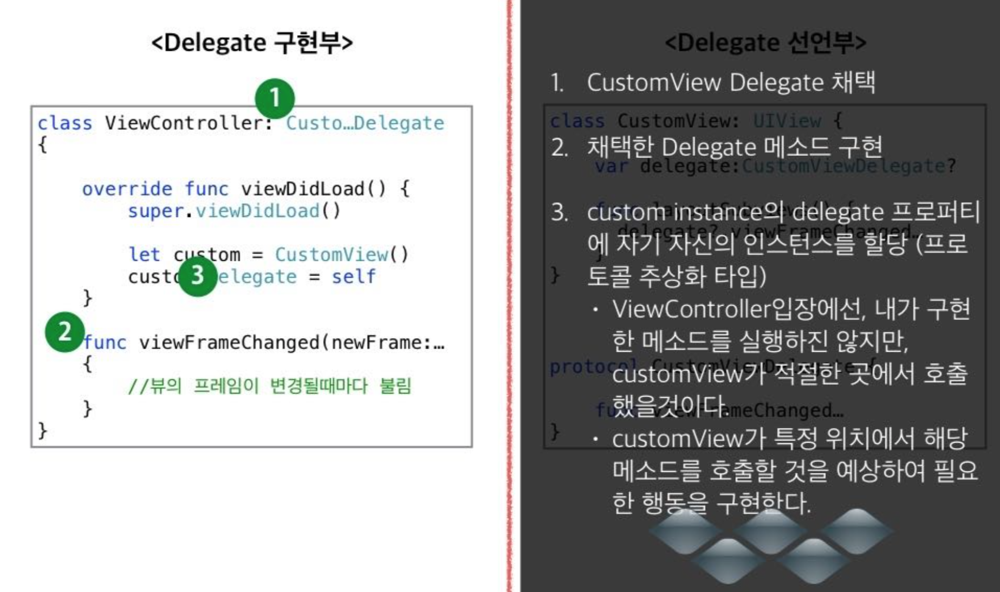

## Delegate Pattern

### Protocol
>* 프로토콜은 원하는 작업이나 기능을 구현되도록 메서드, 프 로퍼티 등 으로 요구 사항의 청사진을 정의합니다. 

>* 클래스, 구조체, 열거형은 프로토콜을 채택하면, 프로토콜에서 요구한 사항에 대해 구현해야 됩니다.

>* 프로토콜을 통해 공통적인 작업을 강제 할수 있으며, 해당 프로토콜을 채택한 사람이 구현한 메소드에 대한 정보도 알수 있다.

```swift

protocol Runable {
	var regCount:Int {get set}
	func run() 
}

class Animal: Runable {
	var regCount:Int = 0 
	func run() {
	
	} 
}
```

>문법

---

```swift
protocol Runable {
	var regCount:Int {get set}
	func run() {
	
	}
}

protocol Flying :Runable {
	var wingCount:Int {get set} 
}

class Animal: Flying {
	var wingCount: Int = 0 
	var regCount:Int = 0 
	func run() {
	
	} 
}
```
>protocol 채택

---

### 추상클래스로의 Protocol

```swift
class Dog: Runable { 
	//...
}

class Horse: Runable { 
	//...
}

func racing(animals:[Runable]) -> Runable {

}
```
>* 프로토콜을 추상 클래스처럼 사용할수 있다.

```swift
let winner:Runable = racing(animals: [Dog(),Horse()])
```

>* 다음과 같은 클래스가 있고, racing 이라는 함수를 구현하려고 한다면 위와 같이 가능하다

>* 프로토콜타입으로 사용가능하다.

---

### Delegate

>* 델리게이트는 클래스나 구조체에서의 일부분의 할 일을 다른 인스턴스에게 대신 하게 하는 디자인 패턴  

>* 뷰가 받은 이벤트나 상태를 ViewController에게 전달해주기 위해 주로 사용된다.(ex:UIScrollViewDelegate...)

>* ViewController를 통해 View구성에 필요한 데이터를 받는 용도로도 사용(ex:UITableViewDataSource) 



---


>선언부 구조


>구현부 구조