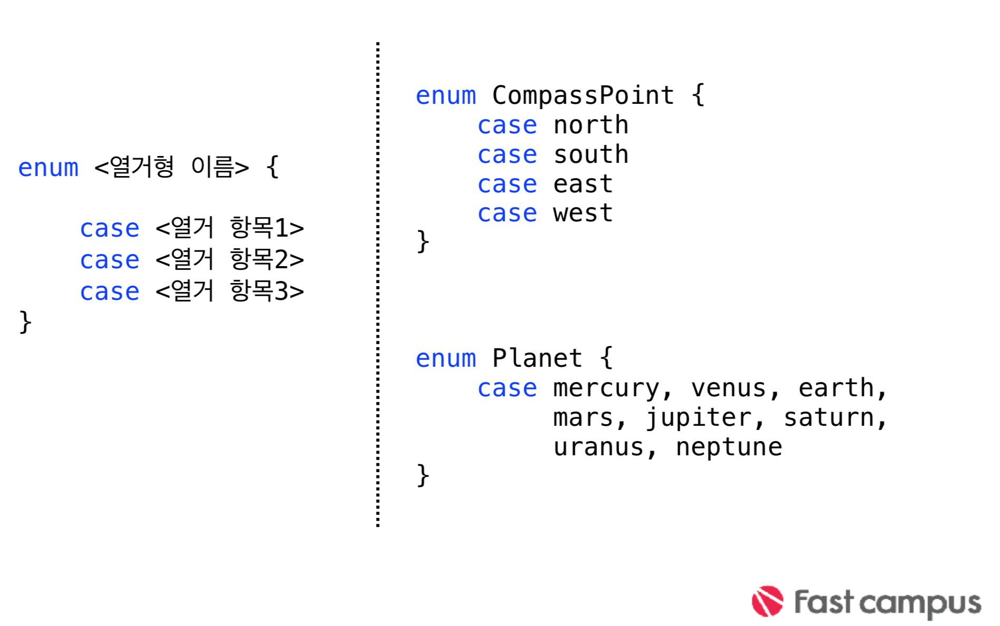

## 열거형(enumeration)
>* 그룹에 대한 연관된 값을 정의하고 사용가능한 타입   
다른 언어와 달리 항목 그자체가 고유의 값으로 해당 항목에 값을 매칭 시킬 필요가 없다.(C계열 언어는 Int타입의 값이 매칭됨)   

>* 원시값(rawValue)이라는 형태로 실제 값(정수, 실수, 문자등)을 부여 할수 있다.   

>* 열거형의 이니셜라이즈를 정의 할수 있으며, 프로토콜 준수, 연산프로퍼티, 메소드등을 만들수 있습니다.


### 문법


```swift
var directionToHead = CompassPoint.west
directionToHead = .north

```
* 각 case값만 들어 갈수 있으며, 선언 후 점( . )문법을 통해 쉽게 다른 값을 설정 할수 있다.

---

### Associated Values

```swift
enum Barcode {
   case upc(Int, Int, Int, Int)
   case qrCode(String)
   }
```
```swift   
<연관 열거형 값지정>
var productBarcode = Barcode.upc(8, 85909, 51226, 3)
	
productBarcode = .qrCode("ABCDEFGHIJKLMNOP")
```
```swift

<연관 열거형 값 불러오기>
switch productBarcode {
	case .upc(let numberSystem, let manufacturer, let product, let check):

	print("UPC: \(numberSystem), \(manufacturer), \(product), \(check).”)

	case .qrCode(let productCode):
         
	print("QR code: \(productCode).")         
}
```
---
```swift

enum Barcode {
	case upc(Int, Int, Int, Int)
	case qrCode(String)
    }
```
```swift
<연관 열거형 값지정>
  	var productBarcode = Barcode.upc(8, 85909, 51226, 3)
productBarcode = .qrCode("ABCDEFGHIJKLMNOP")
```
```swift
<연관 열거형 값 불러오기>
switch productBarcode {
     case .upc(let numberSystem, let manufacturer, let product, let check):   
     
     print("UPC: \(numberSystem), \(manufacturer), \(product), \(check).”)
     case .qrCode(let productCode):
     
     print("QR code: \(productCode).")
}
```
```swift
<Pattern Matching>
let productBarcode = Barcode.upc(8, 85909, 51226, 3)
   if case let Barcode.upc(8, companyCode, productCode, 3) = productBarcode {
   //정상 바코드 
   print(companyCode)
   print(productCode)
}
```
---

### Raw Values

```swift
enum ASCIIControlCharacter: Character {
		case tab = "\t"
		case lineFeed = "\n"
		case carriageReturn = "\r"
       }

enum Planet: Int {
		case mercury=1, venus, earth, mars,
		     jupiter, saturn, uranus, neptune
		}

enum CompassPoint: String {
		case north, south, east, west
       }
```
> 값을 지정 할 수 있다

```swift
let earthsOrder = Planet.earth.rawValue
       // earthsOrder is 3
let sunsetDirection = CompassPoint.west.rawValue
       // sunsetDirection is "west"
```

> .rawValue 프로퍼티를 통해 원시값을 가져올수 있다.

```swift
enum Planet: Int {
		case mercury=1, venus, earth, mars, jupiter, saturn, uranus, neptune
        }
  let possiblePlanet:Planet? = Planet(rawValue: 1)
```
> * 원시값 열거형에서는 초기화 함수를 통해 instance를 만들수 있다. (rawValue:값 지정으 로 인해 생성)

> * 초기화를 통해 만든 인스턴스는 옵셔널 변수로 만들어 진다.
