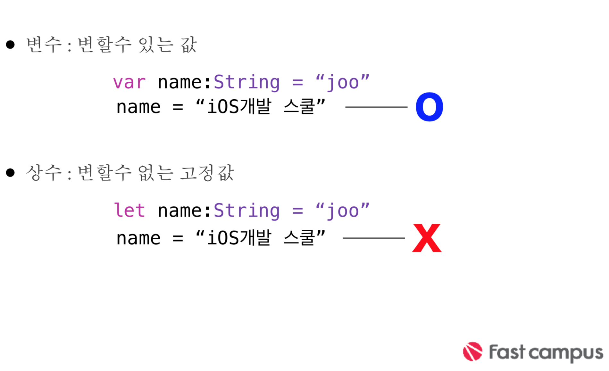

## 함수 & 변수
>변수 : 프로그램에서 데이터의 저장공간을 담당    

>함수 : 프로그램이 실행되는 행동을 담당


### 함수


>변수 만들기 위해 필요한 것?   
>키워드 + 변수 명(Name) + 변수 타입(Type)


> 함수 만들기 위해 필요한것?   
>키워드 + 함수명(Name) + 입력값(Input Value) + 함수 내용(Action) + 결과타입(Return Type)
  


---

### 변수
* 명명규칙에 따라 작성

* 유니 코드 문자를 포함한 거의 모든 문자가 포함될 수 있다.(한글 가능)

* 변수안에 들어있는 데이터를 표현해 주는 이름으로 작성 중복작성 불가 (한 클래스, 함수, 구문 안에서)


---

### 변수 타입


---

### 명명 규칙
* 시스템 예약어는 사용할 수 없다.

* 숫자는 이름으로 시작될 수는 없지만 이름에 포함될 수 있다. 공백을 포함 할 수 없다.

* 변수 & 함수명을 lowerCamelCase, 클래스 명은 UpperCamelCase로 작성한다.

---

### Int & Uint
* 정수형 타입 (Integer)

* Int : +/- 부호를 포함한 정수이다.

* Uint : - 부호를 포함하지 않은(0은 포함) 정수

* 최대값과 최소값은 max, min 프로퍼티를 통해 알아볼수 있다.

* Int8, Int16, Int32, Int64, UInt8, UInt16, UInt32, UInt64의 타입 으로 나눠져 있는데 기본은 시스템 아키텍쳐에 따라서 달라진다.

* 접두어에 따라 진수를 표현할수 있다. (2진법 0b, 8진법 0o, 16진법 0x)

---

### Bool

* 불리언 타입(true, false)

---

### Double & Float

* 부동 소수점을 사용하는 실수형 타입

* 64비트의 부동소수점은 Double, 32비트 부동 소수점은 Float으로 표현한다.

* Double은 15자리,Float은 6자리의 숫자를 표현가능
상황에 맞는 타입을 사용하는것이 좋으나 불확실할때는 Double을 사용하는 것을 권장.

---

### Character

* 단어나 문장이 아닌 문자 하나!

* 문자를 표현하기 위해서는 앞 뒤에 쌍 따옴표(“ ”)를 붙여야 한다. 

* 문자열이 존재하기 때문에 거의 사용하지 않음

* 스위프트는 유니코드 문자를 사용함으로, 영어는 물론, 유니코드 지원 언어, 특수기호등을 모두 사용 할 수 있다.

---

### String

* 문자의 나열, 문자열이라고 한다.

* Character와 마찬가지로 유니코드로 이뤄져 있다.

* 문자열을 다루기 위한 다양한 기능이 제공된다.  (hasPrefix, uppercased, isEmpty등)

* 문자열을 Character로 분해하여 꺼낼 수 있다.


---

### SubString

```swift
let sampleText = "<<<Hello>>>"
let startIndex = sampleText.index(sampleText.startIndex, offsetBy: 3)
let endIndex = sampleText.index(sampleText.endIndex, offsetBy: -3)
let substring1: SubString = template[startIndex... endIndex]
let resultStr:String = String(substring1) // “Hello”
```

> String을 나누면 SubString 타입으로 반환된다.

---

### 튜플

```swift
var coin:(Int,Int,Int,Int) = (3,1,5,3) 
print("10원짜리 : \(coin.0)")
print("50원짜리 : \(coin.1)")
print("100원짜리 : \(coin.2)") 
print("500원짜리 : \(coin.3)”)
var person:(name:String, age:Int, weight:Double)  
 = ("joo", 30, 180.2)
print("이름 : " + person.name)
print("나이 : \(person.age)")
print("몸무게 : \(person.weight)")
```

>* 정해지지 않은 데이터 타입의 묶음

>* 소괄호 ( ) 안에 타입을 묶음으로 새로운 튜플타입을 만들수 있다. ex) (Int, Int) // (String, Int, String)

>* 각 타입마다 이름을 지정해 줄수도 있다. 
ex) (name:String, age:Int)

---

### Any, AnyObject, nil

* Any : 스위프트 내의 모든 타입을 나타냄

* AnyObject : 스위프트 내의 모든 객체 타입을 나타낸다.(클래스) 

* nil : 데이터가 없음 을 나타내는 키워드

---

### 캐스팅(형변환)

```swift
var total:Int = 107
var average:Double
average = total/5   <-- type Error
average = Double(total)/5 <-- casting
```

```swift
var stringNum: String
var doubleNum: Double
let intNum: Int = 3
stringNum = String(intNum) <-- int to string
doubleNum = Double(intNum) <-- int to double
```

---

### Argument Name and Parameter Names


>* 인수명은 함수 호출시 사용 되는 이름.    
  (Argument-아규먼트)

>* 매개변수는 함수 내부에서 사용 되는 변수명.(Parameter-파라메터)

>* 인수명은 생략가능하며, 생략하면 매개변수명이   인수명로 사용된다.

>* 인수명을 제거하고 싶으면 와일드카드 ( _ )를 사용한다.

---

### In-Out Parameter Keyword

```swift
func swapTwoInts(_ a: inout Int, _ b: inout Int) {
let temporaryA = a
a=b
b = temporaryA
}
var someInt = 3
var anotherInt = 107
swapTwoInts(&someInt, &anotherInt)
```

>* 매개변수는 상수값이다.

>* 만약 매개변수의 값을 변경해야 한다면 inout 키워드를 사용하여 inout매개변수로 지정 해야 한다.

>* inout 매개변수 지정은 타입 앞에 inout keyword를 작성해준다.

>* inout 변수가 지정된 함수의 인수앞에서 &가 붙어야 한다.    
(변수를 사용해서 대입할 수 있다. 직접 값 대입 불가)
