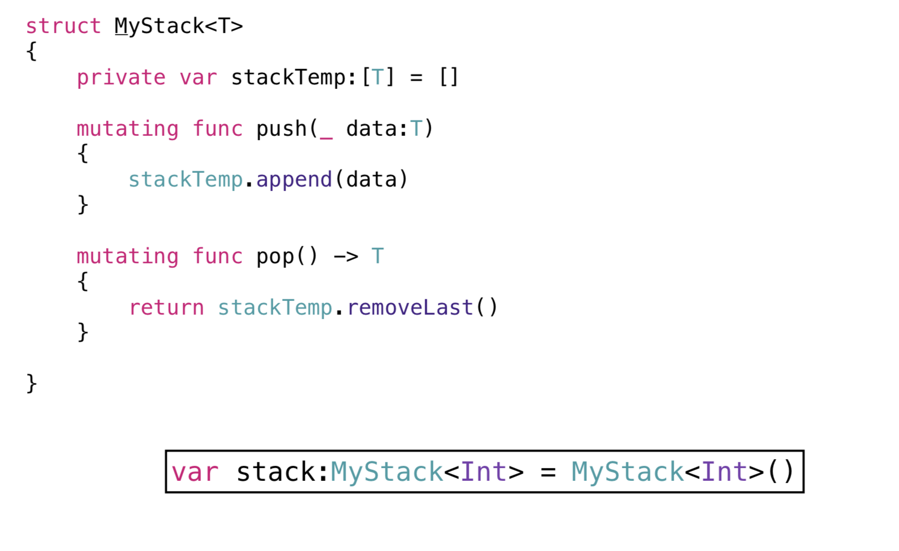

## Generic

> 어떤 타입에도 유연한 코드를 구현하기 위해 사용되는 기능 코드의 중복을 줄이고, 깔끔하고 추상적인 표현이 가능하다.

---

``` swift
func swapTwoValues<T>(_ a: inout T, _ b: inout T) { 
	let temporaryA = a
	a=b
	b = temporaryA
}
 
 var someInt = 3
 var anotherInt = 107
 swapTwoValues(&someInt, &anotherInt)
 // someInt is now 107, and anotherInt is now 3
 
 var someString = "hello"
 var anotherString = "world"
 swapTwoValues(&someString, &anotherString)
 // someString is now "world", and anotherString is now "hello"
```

---

### Type Parameters

>* 제넥릭에 사용된 “T”는 타입의 이름으로 사용되었다기 보다는 placeholder 역할로 사용되었다.

>* 타입은 꺾쇠<> 로 감싸 표시한다.

>* 타입의 이름은 보통 사용되는 속성에 맞게 네이밍 할수 있으나 아무런 연관이 없는 타입의 경우에는 T,U,V 같은 알파벳으로 사용 된다.

---

### Stack의 다양한 타입


---

### Stack Using Generic

