## Git

>* 코드 버전 관리를 효과적으로 해야한다.

>* 개발 히스토리를 저장하고 코드 백업기능

>* 협업을 위한 코드 공유, 관리 tool

---

### What is Git?

>* 깃(Git /ɡɪt/[1])은 프로그램 등의 소스 코드 관리를 위한 분산 버전 관리 시스템 이다. 기하학적 불변 이론을 바탕으로 설계됐고, 빠른 수행 속도에 중점을 두고 있 는 것이 특징이다. 최초에는 리누스 토르발스가 리눅스 커널 개발에 이용하려고 개 발하였으며, 현재는 다른 곳에도 널리 사용되고 있다.

>* 깃의 작업 폴더는 모두, 전체 기록과 각 기록을 추적할 수 있는 정보를 포함하고 있으며, 완전한 형태의 저장소이다. 네트워크에 접근하거나 중앙 서버에 의존하지 않는다.

---

### 버전 관리 시스템

>* 버전 관리 시스템 :프로젝트에 포함된 파일의 변경사항을 추적할 수 있도록 돕는 방법론이나 도구.

> 	- 사용자가 변경한 모든 내용을 추적 관리 가능한 저장소(repository)를 통해 버전관리. 
> 	- 사용자는 변경된 내용을 저장소에 저장(commit)
하나의 중앙 저장소가 있고 모든 사용자는 이 저장소에 변경사항을 전송.
> 	- 중앙 저장소에 접근가능한 모든 사람들이 변경사항을 조회가능하고 최신버전을 복사해서 작업할 수 있다.

---

### 분산 버전 관리 시스템

> * 분산 버전 관리 시스템 : 각 사용자가 프로젝트의 전체 이력을 관리할수 있는  자신만의 저장소를 가지고 있다.

> 	- 기존 버전관리 시스템과 같이 중앙 저장소를 통해 협업 가능

> 	- 사용자는 변경된 내용을 개인 저장소에 저장(commit)   

> 	- 개인 저장소에 있는 변경된 내용을 중앙 저장소에 저장(Pushing)

> 	- 중앙 저장소에 있는 최신 내용을 개인저장소로 가져와 최신버전을 유지가능(pulling) 

> 	- 네트워크 연결이 안되있는 상황에서도 저장소에 저장 가능하고 네트워크 연결시 중앙 저장소와 동기화 실시

> 	- 개인 저장소와 중앙 저장소 모두 프로젝트 전체 이력을 가지고 있어 네트워크 연결이 안돼 있는 상황에서도 변경 이력 조회 가능

---

### Git의 구조

> 1. Work Space
	- 현재 프로젝트의 작업이 이뤄지는 장소
	- work tree/work directory라고도 한다.	

> 2. index
	- work space에 있는 내용을 내부저장소에 저장하기 전 올려두는 중간 단계 공간
	- index공간을 통해서 수정된 파일 중 원하는 파일만 저장소에 저장 시킬수 있다.

> 3. 내부 저장소
	- git이 설치된 내부 컴퓨터

> 4. 외부 저장소
	- 외부에 저장하는 저장소, github이란 서비스도 외부 저장소에 속한다
	
---

### Git 명령어

> 1. init : git 초기화

> 2. clone : 외부저장소에서 프로젝트 내려받기

> 3. add : 변경된 내용을 index 영역에 올려두는 명령어

> 4. commit : index 영역에 있는 내용 내부저장소에 저장 5. status : 현재 git 상태 확인

> 6. branch : 가지치기

> 7. checkout : 작업 환경 이동

> 8. push : 외부저장소에 데이터 저장

> 9. pull : 외부 저장소에서 최신 변경사항 받아오기

---

### Branch Model

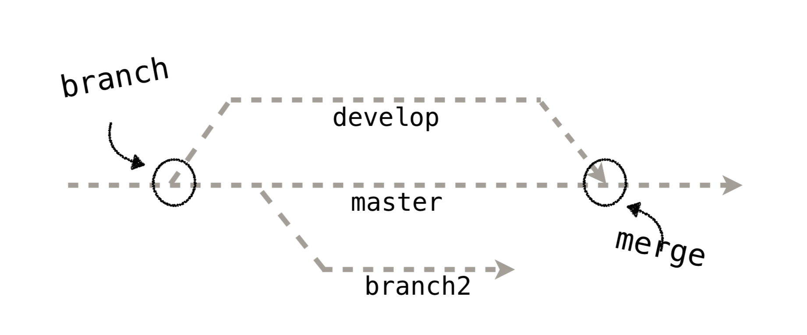

---

### Workflow - Commit

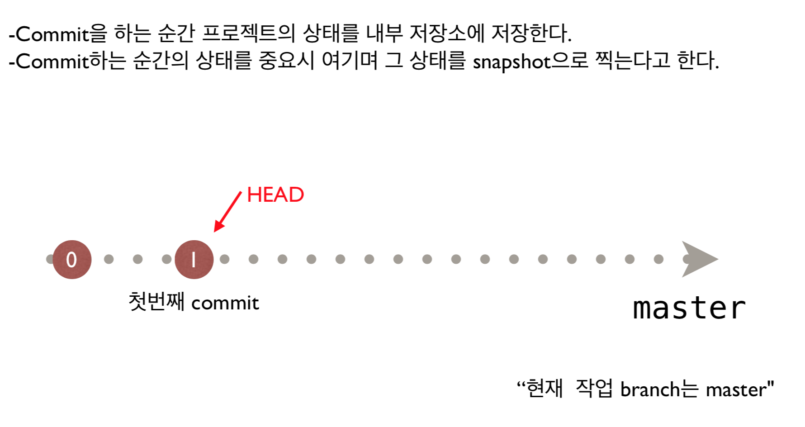

>HEAD는 현재 사용자가 바라보고 있는 곳을 가르키며
Commit시 자동으로 이동 된다.

---

### Workflow - Branch

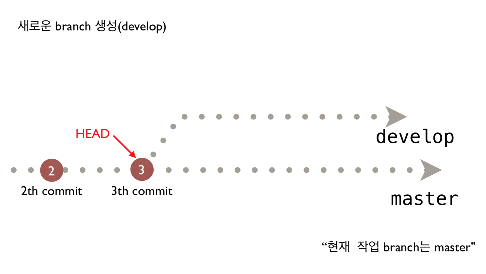

---

### Workflow - checkout

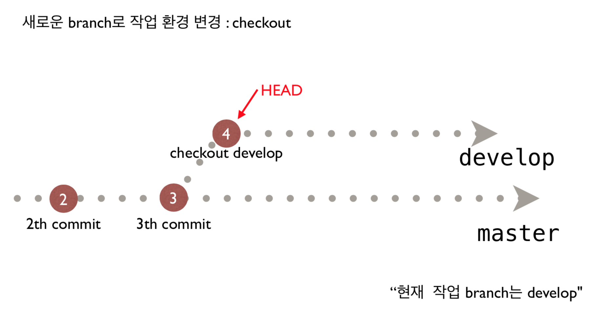

---

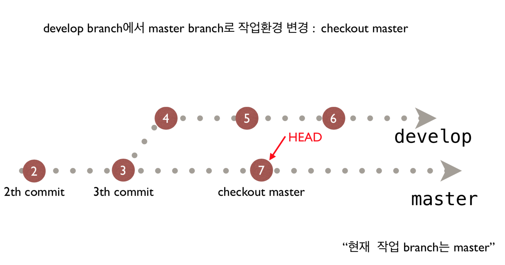

---

### Workflow - Merge

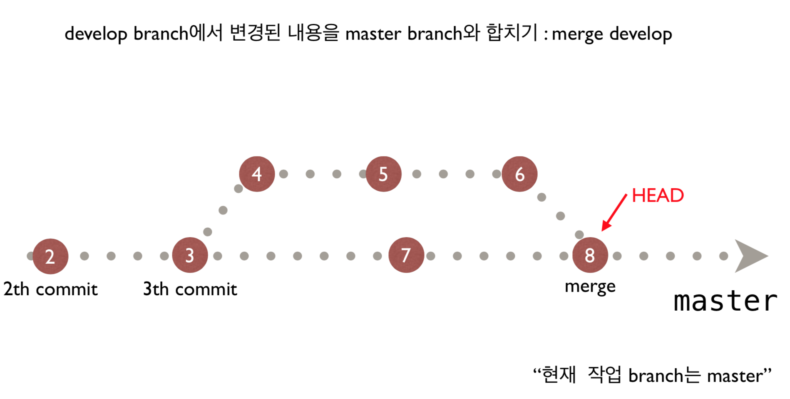

---

### remote setting

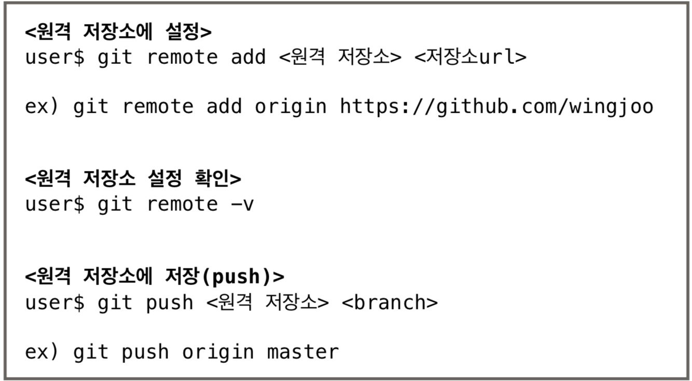

---

### clone and pull

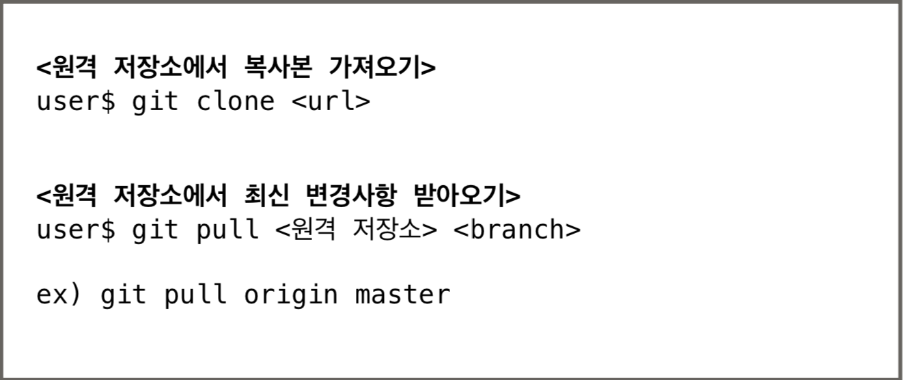

---

### branch

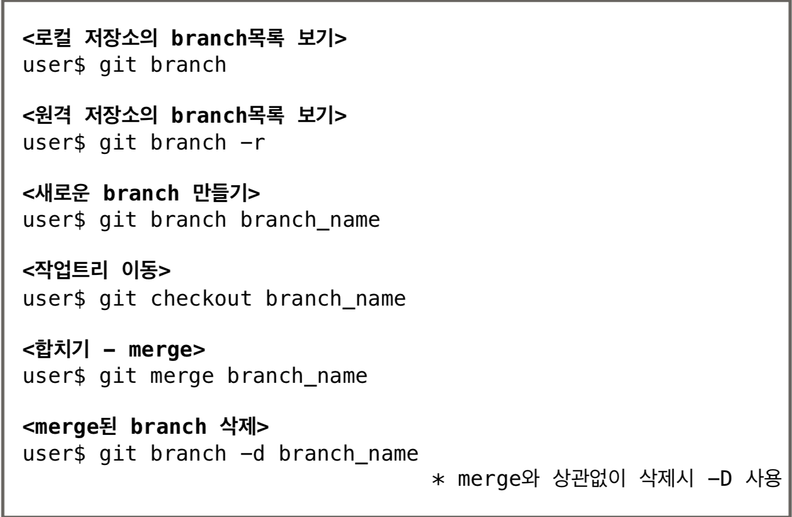

---

### checkout

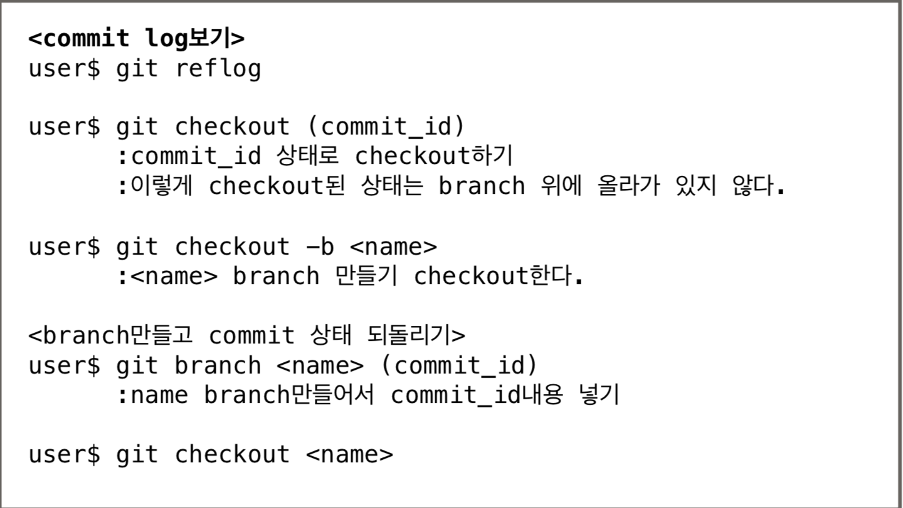

---

### reset

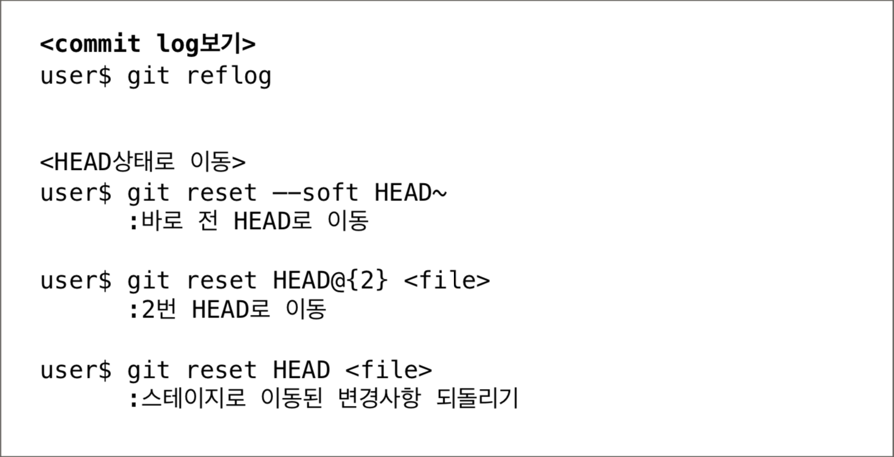

---

### 정리

1. git은 분산 버전 관리 시스템으로 프로젝트 변경 이력을 관리하는데 도움을 준다.
2. git의 작업이 이뤄지는 저장소의 시점을 work tree라고 하며 branch생성을 
통해서 다양한 시점의 작업이 가능하다.
3. branch를 현재 작업tree로 변경하기 위해서는 “checkout”명령을 통해서 변경가능하다. ($git checkout branch_name)
4. index영역이 존재해서 work tree에서 작업한 내용을 곧바로 내부 저장소에 저장하지 않고 선별적으로 저장할 내용을 add 할 수 있다.
5. commit명령을 통해 index에 있는 변경 내용을 내부 저장소에 저장 할 수 있다.
6. 외부저장소를 이용 중앙집중 저장소로 사용할 수 있다.
7. 대표적인 외부 저장소로는 github이란 서비스가 있고 설정을 통해 외부 서버를 만들 수도 있다.
8. push & pull을 통해 외부 저장소에 데이터를 저장하고 불러올 수 있다.
9. clone 명령어를 통해서 외부저장소를 내부 저장소로 복제 할수 있다.

