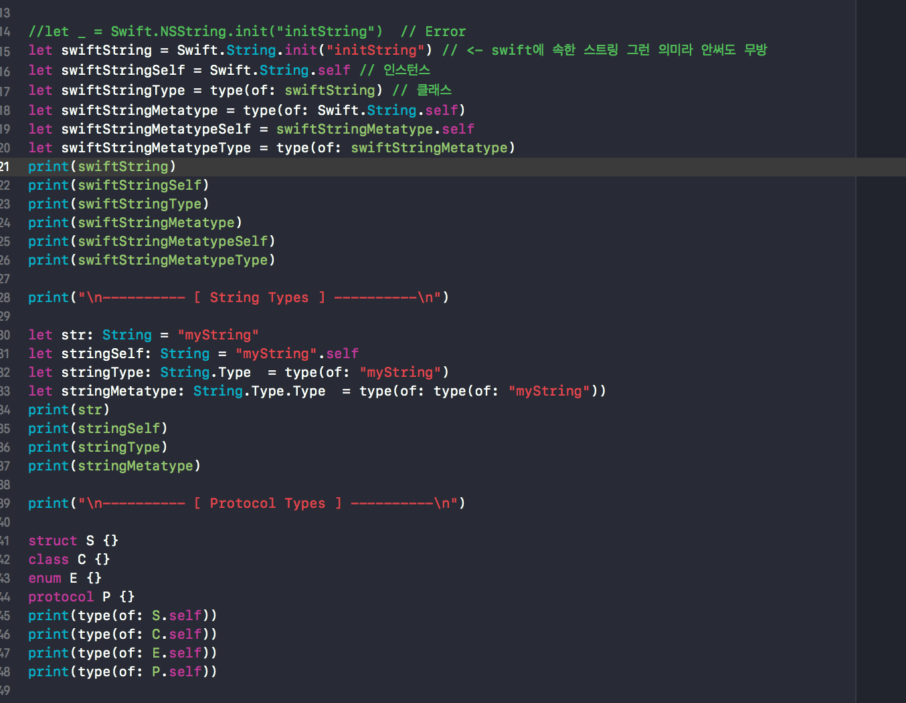
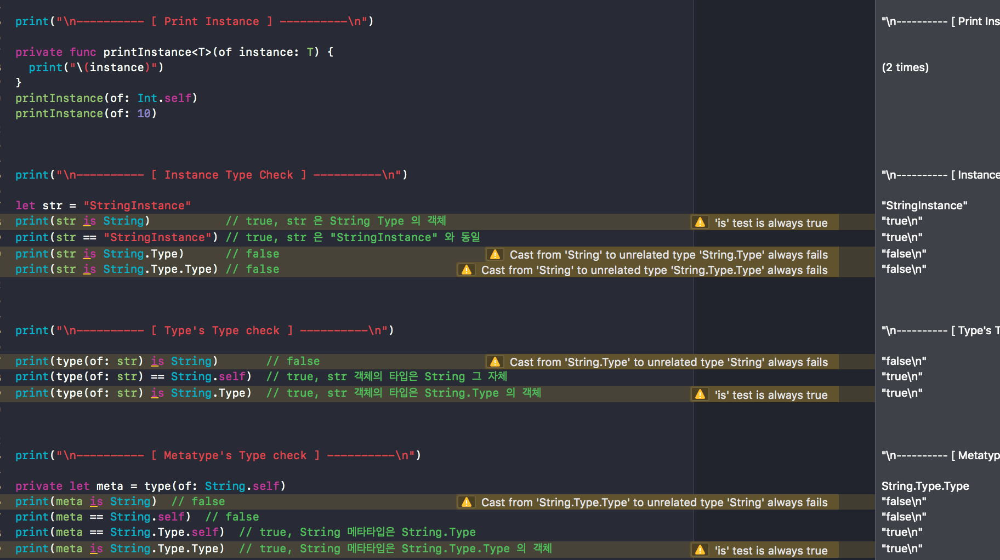

## MetaType

>struct, class, eunm은 .type으로 표시되고 protocol은 protocol로 결과가 나왔다

---

> is는 해당 자료형이 맞는지 알아보기 위함이다

> 결과는 bool이다

---

### 출처 : https://github.com/joohopark/jhbob/blob/master/Study/step4/URLScheme.md

인스턴스 < 타입 < 메타 타입, 우측으로 갈수록 좌측의 것을 포함하는 개념이라고 봐도 될것 같다.

인스턴스 : 타입(혹은 자료형)을 통해 표현된 값으로 메모리에 올라가기 전이라고 보자.(타입의 객체)
타입 : 스트럭쳐, 클래스, 이넘, 프로토콜과 같이 값들에 대한 도메인 값이라고 보자.(메타타입의 객체)
메타 타입 : 타입에 대해서 그를 표현하는 정보를 나타내는 자료형.
키워드

.self : 그 자신을 의미.(예로 어떤 인스턴스에 대해 self로 접근)
.Type : 그 스스로를 표현 할 수 있는 자료형.
메소드

type(of : ~~) : ~~의 자료형의 타입을 리턴

