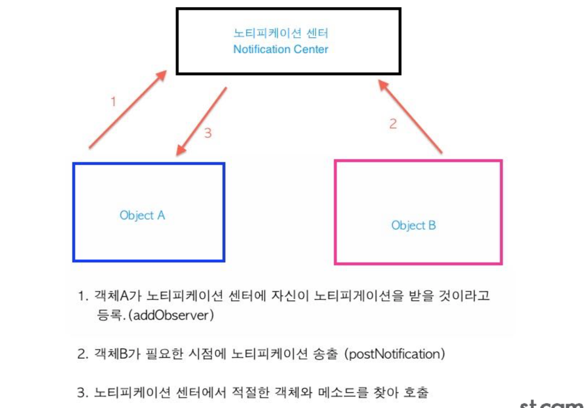
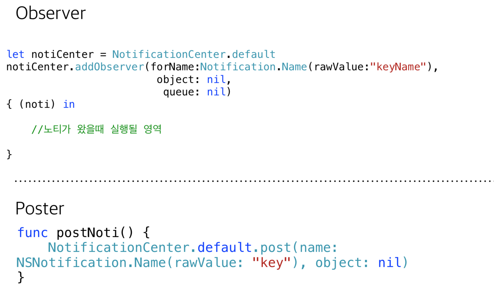
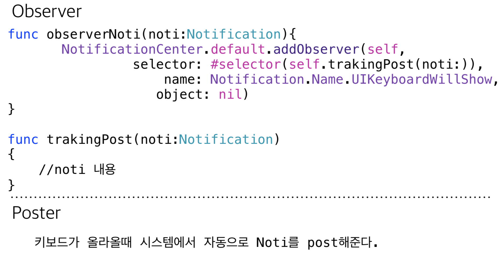

## Notification
> 특정 이벤트가 발생 하였음을 알리기 위해 불특정 다수의 객체에게 알리기 위해 사용하는 클래스

>어떤 객체라도 특정 이벤트가 발생했다는 알림을 받을 것이 라고 관찰자(Observer)로 등록을 해두면 노티피케이션 센터 가 모든 관찰자 객체에게 알림을 준다

---

### Notification 구조

---

### 예제

---

### System Notification

