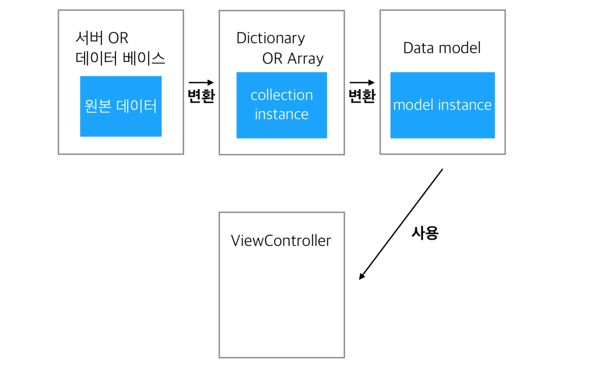
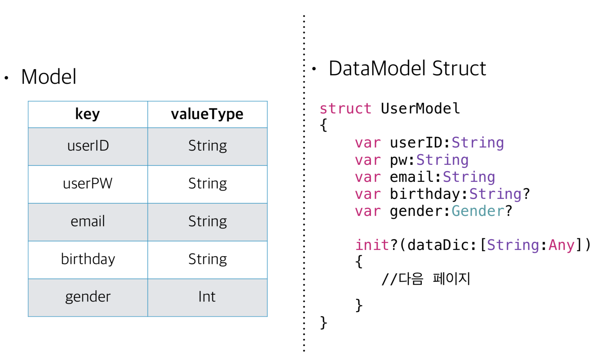
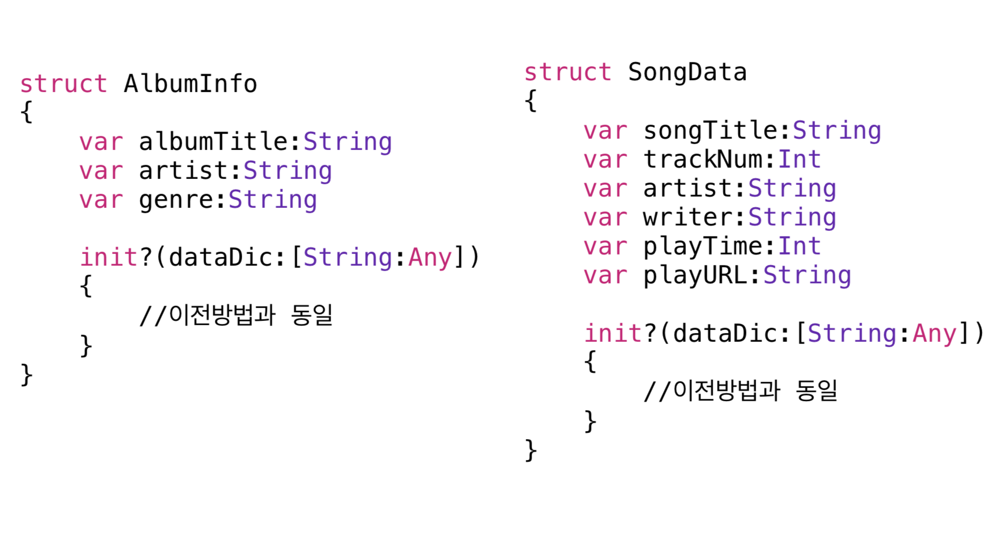

## Singletone Pattern

> 1. 싱글톤 이란? 어플리케이션 전 영역의 걸쳐 하나의 클래스의 단 하나의 인스턴스만(객체)을 생성하는 것을 싱글톤 패턴이라고 한다.

> 2. 사용이유 : 어플리케이션 내부에서 유일하게 하나만 필요한 객체에서 사용(셋팅, 데이터 등)

> 3. 클래스 메소드로 객체를 만들며 static을 이용해서 단 1개의 인스턴스만 만든다.

> 4. 앱 내에서 공유하는 객체를 만들 수 있다.

---

### Singleton Pattern 인스턴스 만들기

```swift
class SingletonClass {
    // MARK: Shared Instance
    static var sharedInstance:SingletonClass = SingletonClass()
    // Can't init is singleton
    private init()
    {
//초기화가 필요하면 private로 생성 }

}
```

---

### Singleton Pattern 예제

```swift
//스크린 정보를 가지고 있는 객체
let screen = UIScreen.main 

//사용자 정보를 저장하는 객체
let data = UserDefaults.standard 

//어플리케이션 객체
let app = UIApplication.shared

//파일 시스템 정보를 가지고 있는 객체
let fileManager = FileManager.default
```

---

### Data Model

* Struct로 데이터 모델 만들기

> - 서버나 데이터베이스에서 가져온 데이터를 바로 사용하지 않고 데이터 모델을 만들어서 사용

> - Struct로 데이터 모델을 만들어 사용한다.(데이터의 경우 참조형 보다는 값 복사형 타입이 좋기 때문이다)

---

* 데이터 컨트롤 흐름



---

* 왜 데이터 모델을 사용하나?

> - 복잡한 구조의 Collection Type을 주로 사용하게 되며, 매번 사 용할때마다 데이터를 끄집어 내기위해 Array & Dictionary instance를 만들어야 한다. (사용 편의성)

> - Dictionary의 데이터는 key값을 통해 데이터에 접근 한다. String type인 key값은 다양한 곳에서 사용하게 되면 오타의 위 험성이 커진다. (안정성)
 
> - 데이터중 Dictionary의 key값 변경시 코드내 사용된 모든 곳을 찾아서 직접 바꿔줘야 한다. (수정 용의)

---

* 데이터 모델 만들기

> - 데이터 하나당 Property 하나로 매칭

> - 필수 데이터와 기타 데이터를 접근 제한자로 구분 

> - 데이터 구조 단순화 작업

> - 가공이 필요한 데이터 만들기

---

* 예제



```swift
init?(dataDic:[String:Any]) {
//필수 항목 모델화
guard let userID = dataDic["UserID"] as? String else {return nil}
self.userID = userID

guard let pw = dataDic["userPw"] as? String else {return nil}
self.pw = pw

guard let email = dataDic["email"] as? String else {return nil}
self.email = email

//옵셔널 항목 모델화
self.birthday = dataDic["birthDay"] as? String

if let rawData = dataDic["gender"] as? Int, (rawData == 1 || rawData == 2) {
}
	self.gender = Gender(rawValue:rawData)
}
```

---

* DataModel Struct



> 
```swift
struct AlbumModel {
var albumInfo:AlbumInfo
var songList:[SongData] = []
init?(dataDic:[String:Any]) {
	guard let infoDic = dataDic["albumInfo"] as? Dictionary<String,Any> else {return nil}
//데이터 인스턴스 만들기
	albumInfo = AlbumInfo(dataDic: infoDic)!
	guard let list = dataDic["songList"] as?  [Dictionary<String,Any>] else {return nil}
//for문을 통해 각 데이터를 모델로 만든후 Array에 추가
	for songDic in list {
		songList.append(SongData(dataDic: songDic)!)
		}
	}
}
```