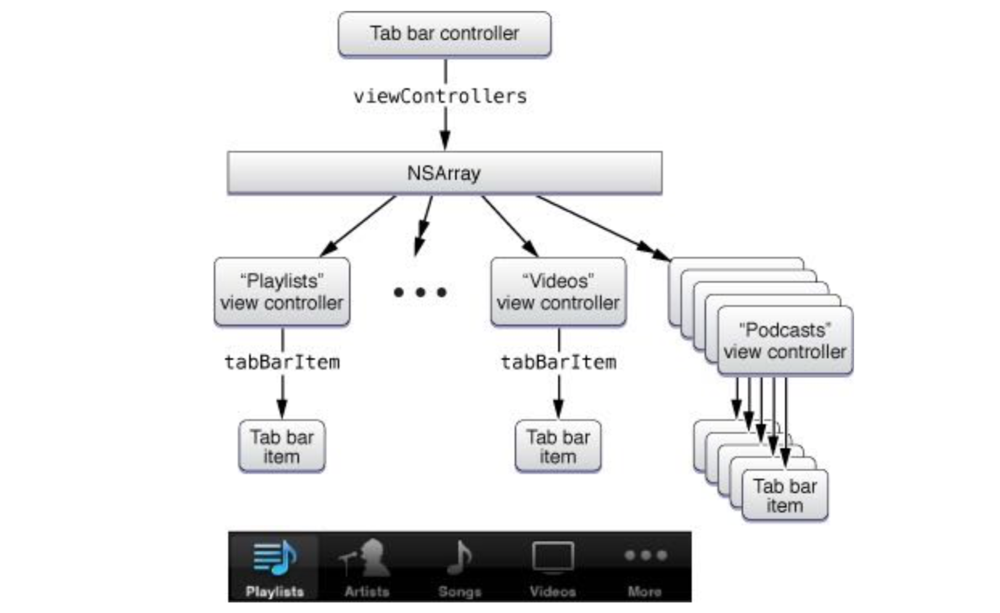
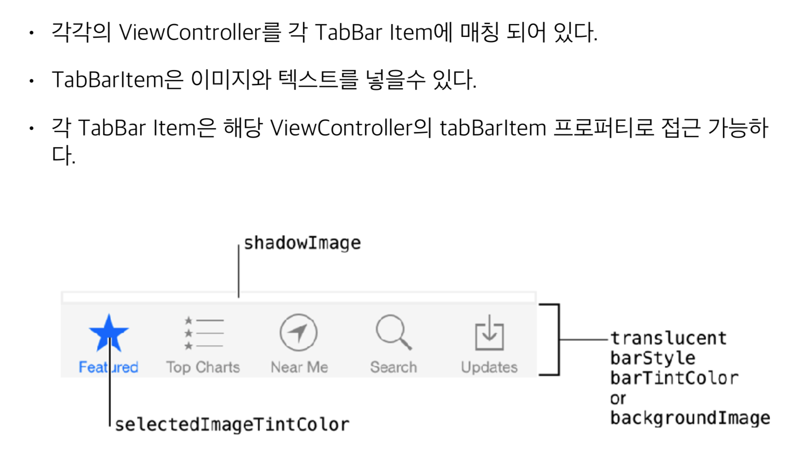
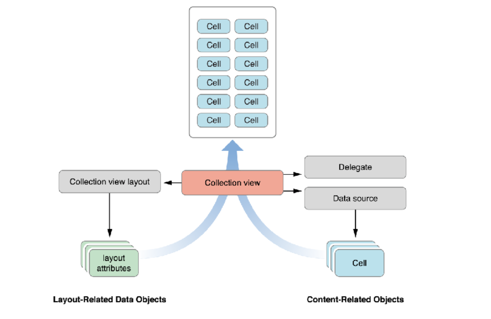
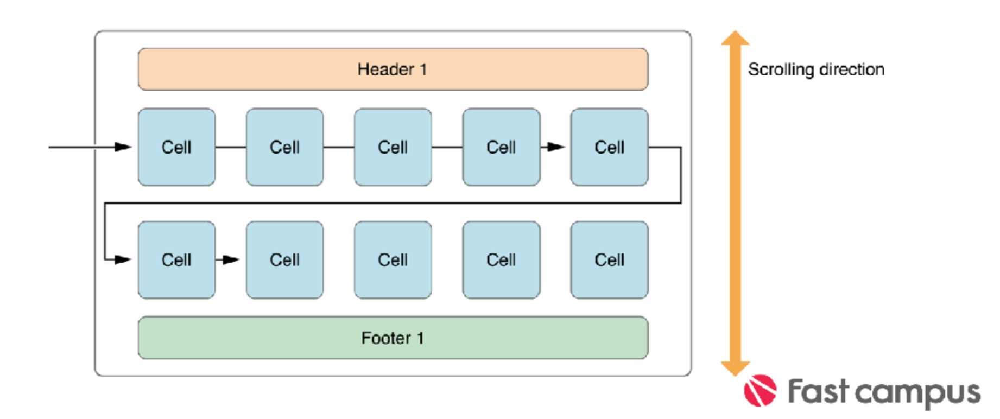
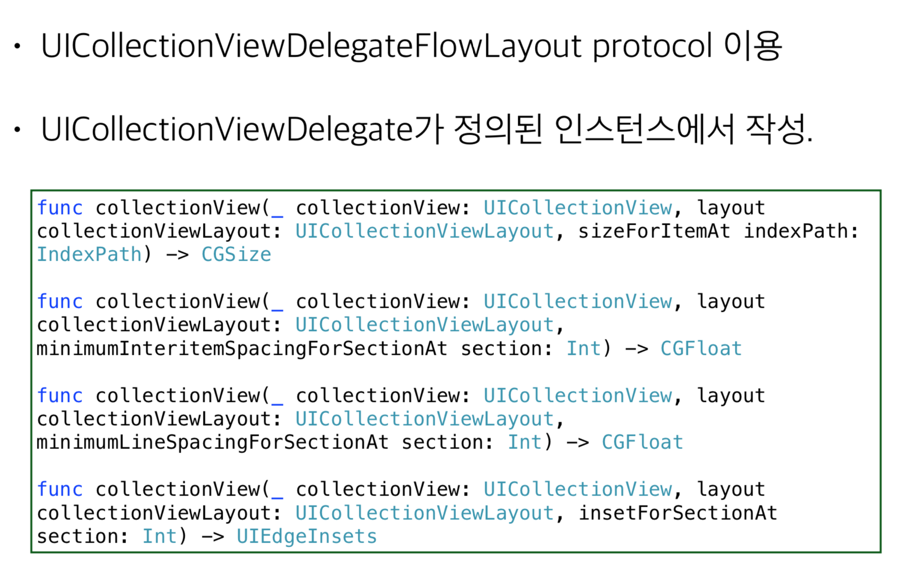

## TapBar



---

### TabBarController 예제 - 스토리 보드

> 1. ViewController OR NavigationController 
선택 

> 2. Editor -> Embad in -> TabBarController 

> 3. TabBarController inital 지정

---

### TapBar Item



---

### UICollection View

> 데이터 항목의 정렬 된 컬렉션을 관리하고 사용자 정의 레이아웃을 사용하여 데이터 항목을 제공하는 객체입니다



---

### FlowLayout



> 1. Item Size : cell끼리 간격
> 2. Line Spacing : Line 간격

---

### Flow Layout Attributes 정의



---

### protocol

> * UICollectionViewDataSource 

> * UICollectionViewDelegate 

> * UICollectionViewDataSourcePrefetching

---

### UICollectionViewDataSource

```swift
 public func collectionView(_ collectionView: UICollectionView,
 numberOfItemsInSection section: Int) -> Int
 
 public func collectionView(_ collectionView: UICollectionView,
 cellForItemAt indexPath: IndexPath) -> UICollectionViewCell
 
 optional public func numberOfSections(in collectionView: UICollectionView)
 -> Int
```

---

### UICollectionViewDelegate

```swift
optional public func collectionView(_ collectionView: UICollectionView,
shouldHighlightItemAt indexPath: IndexPath) -> Bool

optional public func collectionView(_ collectionView: UICollectionView,
didHighlightItemAt indexPath: IndexPath)

optional public func collectionView(_ collectionView: UICollectionView,
didUnhighlightItemAt indexPath: IndexPath)

optional public func collectionView(_ collectionView: UICollectionView,
shouldSelectItemAt indexPath: IndexPath) -> Bool

optional public func collectionView(_ collectionView: UICollectionView,
shouldDeselectItemAt indexPath: IndexPath) -> Bool // called when the user
taps on an already-selected item in multi-select mode

optional public func collectionView(_ collectionView: UICollectionView,
didSelectItemAt indexPath: IndexPath)

optional public func collectionView(_ collectionView: UICollectionView,
didDeselectItemAt indexPath: IndexPath)
```