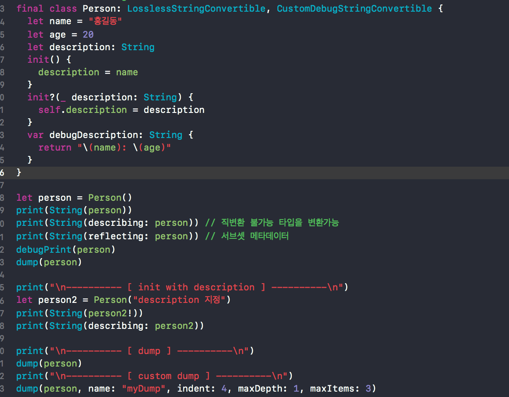

## Textual Representations (print)

### LosslessStringConvertible



>LosslessStringConvertible : description을 사용하여 출력한다

>CustomDebugStringConvertible: debugPring를 사용하며 debugDescription을 리턴시킨다

>dump: 상세히 출력

---

## CollectionFunction

### Stride

```swift
print("\n---------- [ from to by ] ----------\n")

print("- example1 -")
let strideThrough = stride(from: 0, to: 6, by: 3)
var iterator = strideThrough.makeIterator()
while let element = iterator.next() {
  print(element)
}


print("\n- example2 -")
for i in stride(from: 0, to: 10, by: 2) {
  print(i, terminator: " ")
}
print()


print("\n- example3 -")
for radians in stride(from: 0.0, to: .pi * 2, by: .pi / 2) {
  let degrees = Int(radians * 180 / .pi)
  print("Degrees: \(degrees), radians: \(radians)")
}


print("\n- example4 -")
for countdown in stride(from: 3, to: 0, by: -1) {
  print(countdown, "...", separator: "")
}

print("\n- example5 -")
for i in stride(from: 0, to: 5, by: -1) {
  print(i)      // print nothing
```

> from 값으로 시작하여 stride 값만큼 증가하면서 to 값을 포함하지 않는 (숫자 부호에 따라 작거나 큰) 숫자까지 반복

---

### repeatElement

```swift
var tempArr = [0,0,0,0,0]
var repeatArr = repeatElement(0, count: 5)

for num in tempArr{
    print(num)
}
print("--------------------")
for num in repeatArr{
    print(num)
}

print(tempArr)
print(repeatArr)

print("- example1 -")
let zeroes = repeatElement(0, count: 5)
for x in zeroes {
  print(x)
}

print("\n- example2 -")
for x in repeatElement(true, count: 3) {
  print(x)
}

print("\n- example3 -")
//private let printString: (String) -> () = { print($0) }
private func printString(_ str: String) {
    print(str)
}

repeatElement("Swift", count: 3).forEach(printString(_:))
```

> * 동일 요소를 count 값만큼 가진 컬렉션 생성

> * 맨아래는 count 값 만큼 가지고 있다가 forEach에 의해 하나씩 꺼내진 경우다

---

### Zip

```swift
print("- example1 -")
let words = ["일", "이", "삼", "사"]
let numbers = 1...4

for (word, number) in zip(words, numbers) {
  print("\(word): \(number)")
}

print("\n- example2 -")
let naturalNumbers = 1...Int.max
let zipped = Array(zip(words, naturalNumbers))
print(zipped)


print("\n- example3 -")
let names = ["James", "Edward", "John", "Jessie", "Julia"]
let scores = [100, nil, 90, nil, 70, nil]
zip(names, scores).forEach { print($0, $1) }
print()
zip(names, scores.flatMap { $0 }).forEach { print($0, $1) }

print("\n- example4 -")
let filenames = ["image", "text", "video"]
let extensions = ["png", "txt", "mpeg", "pdf", "jpeg", "html"]
zip(filenames, extensions).forEach { print($0 + "." + $1) }
``` 
>* 두 개의 시퀀스를 통해 새로운 한 쌍의 시퀀스를 생성
>* 제일 적은 기준에 맞춰서 나머지 zip에 묶이는 양도 같아진다 
>* flatMap에 의해 nil 값은 빠진상태로 모아진다

---

### sequence

```swift
print("\n---------- [ sequence(first:next:) ] ----------\n")

print("- example1 -")
var multiplyBy2 = sequence(first: 1) { $0 * 2 }
//multiplyBy2.forEach { print($0) }  // 무한루프
print(multiplyBy2.next())
print(multiplyBy2.next())
print(multiplyBy2.next())
print(multiplyBy2.next())
multiplyBy2.prefix(7).forEach { print($0) }
print(multiplyBy2.next())
print(multiplyBy2.next())
multiplyBy2.prefix(7).forEach { print($0) }


print("\n- example2 -")
let repeatSeq = sequence(first: 5) { $0 }
for x in repeatSeq.prefix(5) {
  print(x)
}
```
>* first 값으로 시작하여 next 값을 lazy 하게 반복하는 순열 생성
>* next로 인해 숫자가 따로 모아지고 prefix로 불러졌어도 다시 next하면 전에 모아졌던 next부터 다시 모은다고 이해하자.
>* next로 뽑힌 값은 옵셔널이다

---

### etc

```swift
print("\n---------- [ enumerated ] ----------\n")

for (idx, num) in [5,1,2,4,3].enumerated() {
  print(idx, num)
}

print("\n---------- [ sorted ] ----------\n")

for (idx, num) in [5,1,2,4,3].sorted().enumerated() {
  print(idx, num)
}

print("\n---------- [ reversed ] ----------\n")

for (idx, num) in [5,1,2,4,3].sorted().enumerated().reversed() {
  print(idx, num)
}

```
>index값을 뽑아준다