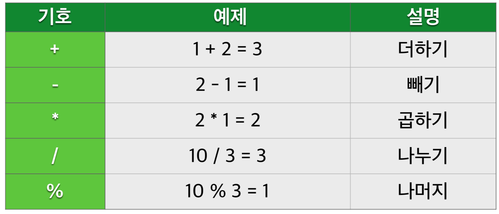
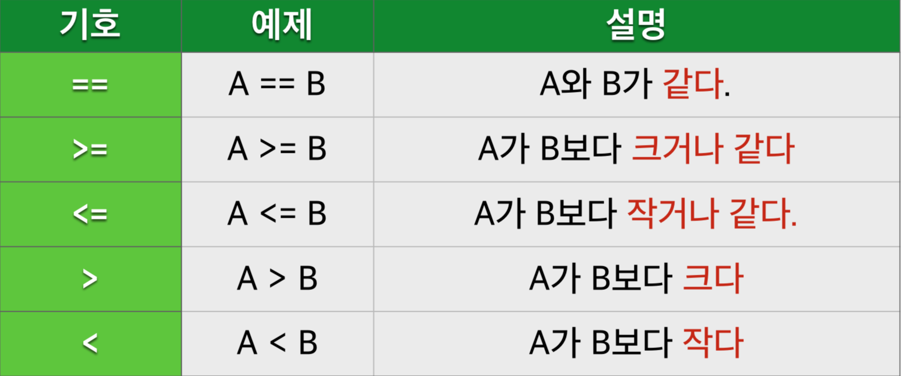
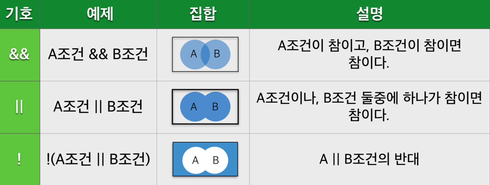
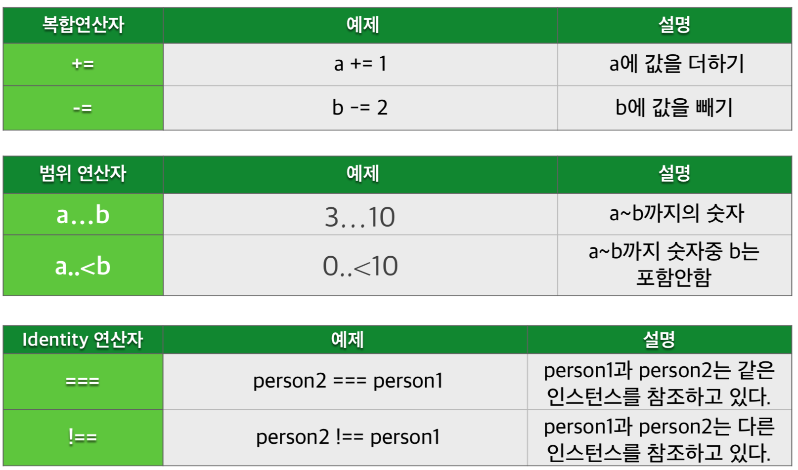
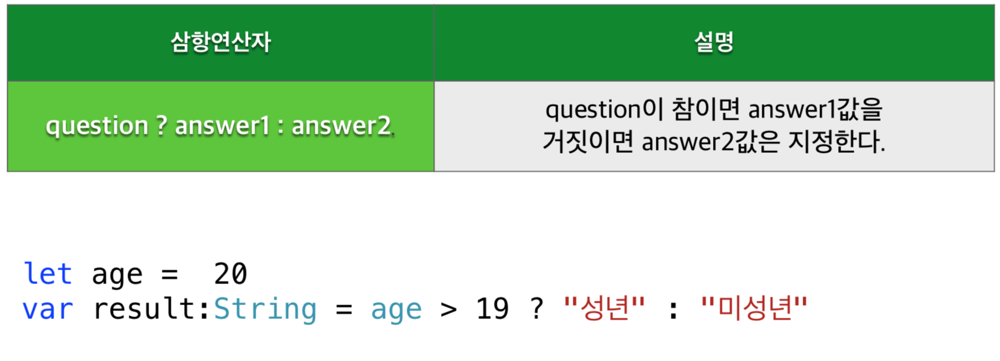

## 조건문
> * 함수 내부에서 실행되는 선택문

> * 특정 조건에 따라 선택적으로 코드를 실행시킨다. 

> * 대표적인 조건문으로 if-else문과 switch-case문이 있다.

### if-else문

```swift
if 조건 {
//조건이 만족되면 실행
} else {
//조건이 만족되지 않을때 실행
}
```
>조건값은 참,거짓의 나타나는 Bool값으로 표현

---

### else if문

```swift
if 조건1 {
//조건1이 만족되면 실행
} else if 조건2 {
//조건1이 만족되지 않을때 실행
} else {
//조건들 모두 만족되지 않을때 실행
 }
```
>조건2는 조건1이 거짓일때 실행된다.

---

### 산술연산자



---

### 비교연산자



---

### 논리연산자



---

### 추가연산자



---

### 삼항연산자



---
